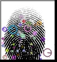
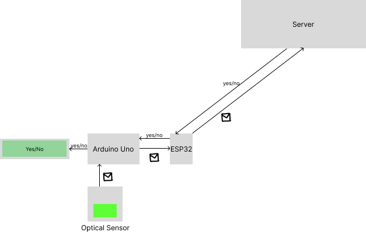

# fingerprint-matching-algo

For Testing Download below dataset, it contains 6000 all ten finger data of 600 people
Dataset on https://www.kaggle.com/datasets/ruizgara/socofing?resource=download
Data Collection Research Paper: https://arxiv.org/pdf/1807.10609.pdf


After Parallelization (Total Fingerprint 24,000)
```
Number of CPU: 16
Number of fingers we ran search on:  24000
Best Score: 63.63636363636363
Filename: 1__M_Left_little_finger.BMP
Knn Time (Actual time that machine will take): 4.7036426067352295
Image Process Time (We will pre-compute it): 3.254831552505493
Loop Time: 0.0018205642700195312
Total Time: 7.960696220397949
```


After Parallelization in flask server:
```
127.0.0.1 - - [16/Apr/2024 03:23:14] "GET / HTTP/1.1" 200 -
Number of CPU: 16
Number of fingers we ran search on:  6000
Best Score: 63.63636363636363
Filename: 1__M_Left_little_finger.BMP
Knn Time (Actual time that machine will take): 1.3178911209106445
Image Process Time (We will pre-compute it): 2.384185791015625e-07
Loop Time: 0.00036787986755371094
Total Time: 1.3183157444000244
```


### How do we find corners?
<!-- Add image from local -->

<br>
We use shift to find corners in the image. [Paper]( https://www.cs.ubc.ca/~lowe/papers/ijcv04.pdf)

Reason for such closed fingerprint system is because SHIFT is patented, but now under public domain since 2020

Another alternative
FAST https://docs.opencv.org/4.x/df/d0c/tutorial_py_fast.html

Maximum Machine Cost = 4K
Estimated Machine Cost =  2.5K


Single Server Process All requests



GitHub Repo that allow to extract image from these modules [example link](https://github.com/brianrho/FPM/blob/master/examples/image_to_pc/image_to_pc.ino) and [repo link](https://github.com/brianrho/FPM)


Ways to optimize
1. Use Faster Feature Detector: Instead of SIFT, you can use faster feature detectors like ORB or AKAZE, which are generally faster than SIFT while still providing decent performance.
2. Limit Keypoint Detection: You can limit the number of keypoints detected in both the sample and target images. Since you are comparing fingerprints, not all keypoints are necessary for matching.
3. Parallelization: Use parallel processing to perform matching on multiple images simultaneously, which can significantly reduce the overall processing time, especially if you have a multi-core CPU.
4. Approximate Nearest Neighbors: Use approximate nearest neighbor search algorithms like FLANN or KD-trees, which are faster than exact nearest neighbor search.
5. Optimize Matching Parameters: Adjust matching parameters such as the distance ratio threshold and the number of trees in the FLANN index to improve matching speed without sacrificing accuracy.
6. Precompute Keypoints and Descriptors
7. Reduce Image Size